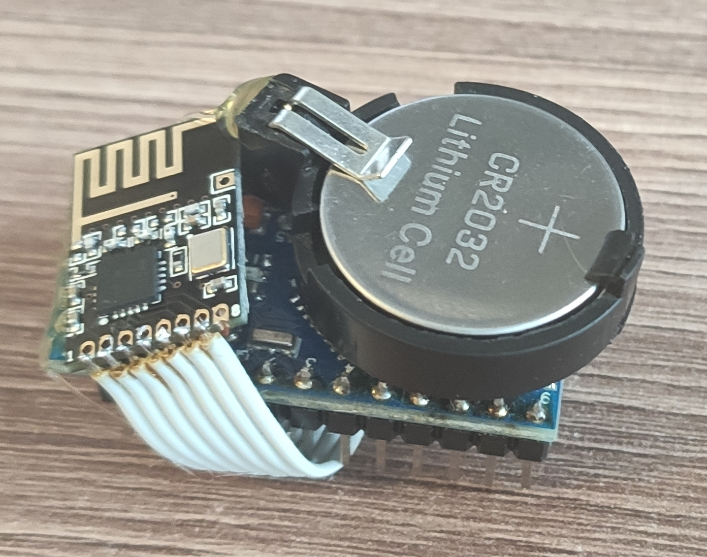

# Weather Node

**Weather Node** is a small battery-powered temperature and humidity sensor that transmits measurements via Bluetooth LE to your phone.

The battery is expected to last for 3 - 6 months (depending on battery and ambient temperature).

You can easily assemble your Weather Node as it requires very few components:
- MCU board with nRF24LE1 microcontroller;
- DHT22 (or DTH11) temperature/humidity sensor;
- battery socket for CR2032;
- two resistors (10k), two capacitors (0.1uF and 4.7uF), and an LED.

After assembling, you could get something like this: 

Schematics:

In order to upload firmware to the nRF24LE1 board you may also need FT232RL usb-uart convertor or an Arduino. Check out these links for more info on nRF24LE1 flashing options.

- [Program nRF24LE1 with FT232R](https://github.com/jdelfes/nrf24le1_flasher)
- [Program nRF24LE1 with Arduino](https://github.com/DeanCording/nRF24LE1_Programmer)

## Arduino-based Weather Node

A version of Weather Node built with Arduino Pro Mini (or any other) and nrf24L01 module.

This is a reworked version of [BLE_beacon](https://github.com/cbm80amiga/BLE_beacon) project by [cbm80amiga](https://github.com/cbm80amiga) adapted in a way so it would work with [Weather Node Station](https://github.com/AlexIII/weather-node#weather-node-station), an Android app.

The device can use external DHT11 sensor (humidity + temperature) or internal Arduino sensor (temperature only).

Main changes from the original version:
- CPU clock is lowered to 8MHz for boards with 16 MHz crystal (for reliable operation from 3v battery);
- connection of `CE` pin of nrf24L01 moved to Arduino pin `A0`;
- BLE data format of [Weather Node](https://github.com/AlexIII/weather-node#ble-protocol-details);
- random MAC generation on power-on;
- usage of calibration values for the internal Arduino temperature sensor (this should give better temperature precision);
- longer sleep period.

#### Notes on Arduino power supply
If you plan to power the device from CR2032 or another low-capacity power source, add 300uF capacitor in parallel to the battery, as nrf24L01 chip creates a current surge during data transmission that can reset the Arduino. Also, remove the power regulator IC and LEDs from the Arduino board for lower power consumption.

## Weather Node Station

**Weather Node Station** is an app for your phone that receives data from Weather Nodes.

Only Android version is available now (`.apk`). After installation you will need to give the app permissions to access Bluetooth (on modern Android versions it also requires Location permissions as well). 

The app is developed with react-native framework, so it's possible to compile it for IOS (I'm sure it'll require some fixes though). You're very welcome to try and do that, especially if you have the necessary environment installed.

## How to use with ESPHome and Home Assistant

See [#8](https://github.com/AlexIII/weather-node/issues/8)

## Project Files

- wnode1-firmware/ - firmware for Weather Node MCU (nRF24LE1). Project for [Code::Blocks](http://www.codeblocks.org/) with [SDCC](http://sdcc.sourceforge.net/)
- wnode2-arduino-firmware/ - Arduino sketch for Arduino-based Weather Node
- wnodestation/ - [React Native](http://reactnative.dev) app for phone

## Known Issues

1. DHT22 turned out to be a crappy sensor. It showed very bad stability under freezing temperatures and low voltage power supply. It will be replaced with superior AHT10 the moment I'll get my hands on it.

Funny readings from DHT22 after 12 hours in my fridge (~ +5°C).

## BLE Protocol Details

Weather Node emulates BLE advertisement packages. All meaningful data is packed in "Manufacturer Data" section. Layout of the section:

| Field       | Offset (bytes) | Size (bytes) | Value                                                        |
| ----------- | -------------- | ------------ | ------------------------------------------------------------ |
| UUID        | 0              | 2            | UUID[0] == 0xA9, UUID[1] ==0x53                              |
| Humidity    | 2              | 2            | Humidity in DHT22 format  If (humidity[0] == 0x80 && humidity[1] == 0x00) then  the channel is inactive. |
| Temperature | 4              | 2            | Temperature in DHT22 format                                  |
| Flags       | 6              | 1            | Bits 0, 1: battery level (0 - HIGH, 1 - MED_HIGH, 2 - MED_LOW, 3 - LOW)   Bit 2: sensor failure flag |
| Reserved    | 7              | 1            | - |

## License

All files in this repo, except `./wnode1-firmware/nRF24LE1_SDK` and `./wnode2-arduino-firmware` go by MIT License © github.com/AlexIII

- `wnode1-firmware/nRF24LE1_SDK` is a separate project. It's licensed under LGPL v2.1.
- `wnode2-arduino-firmware` is a modified fork of [BLE_beacon](https://github.com/cbm80amiga/BLE_beacon) project by [cbm80amiga](https://github.com/cbm80amiga). It's licensed under LGPL v3.0 © 2019 Pawel A. Hernik.

Due to SDK licensing, precompiled firmware (`*.hex`) for nRF24LE1 is under LGPL v2.1.

